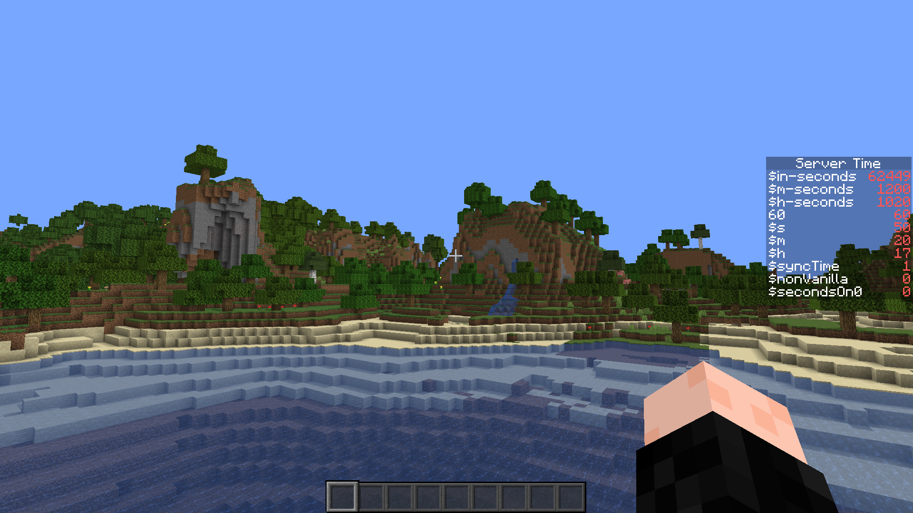

# RealTime API 

A datapack API that saves the server time into a scoreboard objective.

It can also **sync** Minecraft time to the server time!

**Works with Bukkit!**

**How to use:**

 1. Install the datapack

 2. That's it! You can now read the time from the `rlTime` scoreboard objective.

 3. You may also set `$syncTime` to 1, to sync the Minecraft time to the server time.

    

You may use this in your own datapack / Minecraft world without crediting me.

